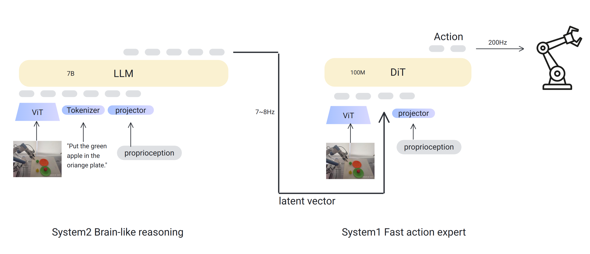

# RealDualVLA: A real dual system Vision-Language-Action Framework



**Real Dual VLA** is a novel robotic control framework that synergizes the powerful semantic reasoning capabilities of 7B Prismatic VLM with the precise, continuous action generation of a 100M DiT action head.

By integrating a large-scale VLA backbone with a specialized diffusion-based policy head, this system bridges the gap between high-level language understanding and low-level fine motor control.

### Key Features

*   **Dual-System Architecture**: Leverages Sys2 (7B Prismatic) as the semantic backbone to process complex language instructions and visual context, while utilizing DiT as a dedicated low-level controller for high-frequency, precise motion synthesis.
*   **Sys2: Semantic Backbone**: Utilizes a 7B Prismatic VLM as the high-level reasoning engine. It processes multimodal inputs (language instructions and images) to extract rich semantic features and linguistic embeddings, providing the necessary context for the Sys1 action head.
*   **Sys1: DiT Action Head**: Replaces standard discrete action tokenization with a **Flow Matching** based policy. The Sys1 conditions on Sys2's linguistic embeddings and high-fidelity visual features (via SigLIP) to generate robust continuous actions.
*   **Independent Visual Encoders**: Each system operates with its own specialized visual encoder. Sys2 utilizes its native vision backbone for semantic understanding, while Sys1 employs a separate **SigLIP** encoder to capture fine-grained visual details required for precise manipulation. 


## Installation
## Set Up Conda Environment

```bash
# Create and activate conda environment
conda create -n rd_vla python=3.10 -y
conda activate rd_vla

# Install PyTorch
# Use a command specific to your machine: https://pytorch.org/get-started/locally/
pip3 install torch torchvision torchaudio

# Clone rd_vla repo and pip install to download dependencies
git clone https://github.com/LivsynRobotics/RealDualVLA
cd RealDualVLA/
pip install -e .

# Install Flash Attention 2 for training (https://github.com/Dao-AILab/flash-attention)
#   =>> If you run into difficulty, try `pip cache remove flash_attn` first
pip install packaging ninja
ninja --version; echo $?  # Verify Ninja --> should return exit code "0"
pip install "flash-attn==2.5.5" --no-build-isolation
```

## Download Pretrained Weights
Download the SigLIP visual encoder for the fast system (Sys1) from the [siglip](https://huggingface.co/google/siglip-so400m-patch14-224)

Download the initial weights for the slow system (Sys2) from the [openvla-7b](https://huggingface.co/openvla/openvla-7b)


## Training Pipeline

The training process is divided into two distinct stages to ensure stability and performance:

1.  **Stage 1: Sys2 Autoregressive Training**: The semantic backbone (Sys2) is trained first using standard autoregressive next-token prediction. This stage focuses on aligning multimodal inputs and establishing high-level reasoning capabilities.
```
./vla-scripts/train_sys2.sh
```
2.  **Stage 2: Sys1 Diffusion Training**: In this stage, Sys2 operates in **inference-only mode** (frozen). We extract the rich linguistic embeddings from Sys2's **last hidden layer** to condition Sys1. Sys1 is then trained to generate continuous actions via Flow Matching, leveraging the semantic context provided by the frozen Sys2 without altering the backbone's reasoning abilities.
```
./vla-scripts/train_sys1.sh
```

## Inference

To run the inference, launch the two systems in separate terminals:

```bash
# Terminal 1: Launch Sys2 (Semantic Backbone)
./vla-scripts/deploy_sys2.sh

# Terminal 2: Launch Sys1 (Action Head)
./vla-scripts/deploy_sys1.sh

# Run simple inference test with fake data
python vla-scripts/simple_infer.py
```


## Citation

If you use this project in your research, please consider citing it as:

```bibtex
@misc{RealDualVLA,
  author       = {LivSyn team},
  title        = {RealDualVLA: A real dual system Vision-Language-Action Framework},
  year         = {2025},
  howpublished = {\url{https://github.com/LivsynRobotics/RealDualVLA}},
  note         = {Accessed: 2025-12-05}
}
```

## Acknowledgements

This codebase is based on [Openvla-oft](https://github.com/moojink/openvla-oft), [RDT](https://github.com/thu-ml/RoboticsDiffusionTransformer).
